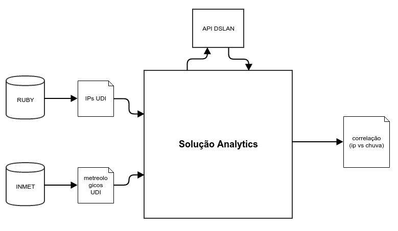
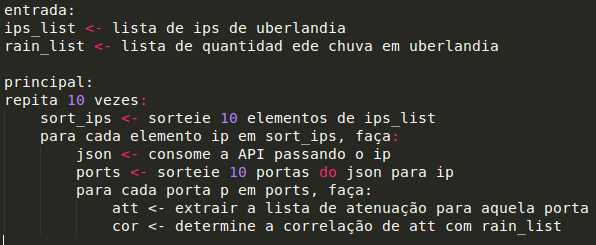
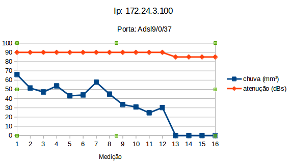
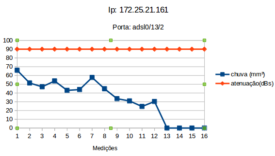
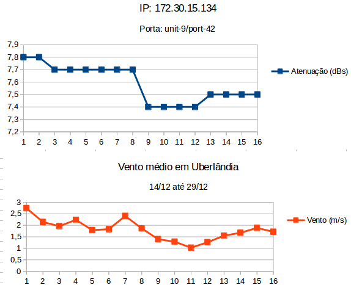

# Correlação entre taxa de atenuação com chuva e vento dos equipamentos da rede banda larga em Uberlândia

Neste trabalho foi desenvolvido um sistema que analisa a correlação entre a quantidade de chuva na cidade de Uberlândia e a taxa de atenuação dos equipamentos que compõem a banda larga ADSL da cidade.

A figura abaixo ilustra a arquitetura do trabalho, nela podemos observar que a solução de analytics precisa de dois inputs: uma lista com todos os IPs da cidade de Uberlândia e outra lista com os dados metereológicos em Uberlândia por dia.

A primeira lista pode ser extraída da nossa plataforma Ruby. Já o segundo parâmetro precisa ser extraído do site do INMET (http://www.inmet.gov.br/sonabra/pg_dspDadosCodigo_sim.php?QTUwNw). O próximo passo que a solução realiza é consumir uma API passando os IPs e recebendo a lista de atenuação daqueles equipamentos. Depois disso, a solução determina qual a correlação da atenuação de cada equipamento com os dados metereológicos da chuva.

## Coletando os dados:
- Ips do Ruby: Neste trabalho, foi solicitado para a Camila Cerqueira Lott extrair a lista de IPs da cidade de Uberlândia.
- Dados metereológicos:

1) Para coletar os dados metereológicos de Uberlândia acesse o link: http://www.inmet.gov.br/sonabra/pg_dspDadosCodigo_sim.php?QTUwNw;

2) Insira as informações de “Data início” e “Data fim” nos campos correspondentes;

3) Digite o número apresentado ao lado para confirmação e clique em “OK”.

- Consumindo os dados da API:
Para acessar a API que contém os dados, você deve-se pedir uma regra de firewall para o servidor 172.20.4.169. Depois que tiver o acesso, basta consumir este serviço: http://172.20.4.169:8080/dslams-extractor/service/dslams/172.30.15.139?snapshotsNum=20

## Quantidade de dados:
- IPs em Uberlândia: a lista extraída do Ruby continha 540 IPs.
- Quantidade de porta: é variado de equipamento para equipamento. Mas há equipamentos com mais de 100 portas.
- Dias coletados: Foram coletados os dados da atenuação e da chuva do dia 14/12/2017 ao dia 29/12/2017, totalizando 16 dias que eram os dados disponíveis na API DSLAN.
- Tamanho da amostra: foi realizado 10 experimentos com 10 IPs e 10 portas aleatórias. Totalizando 1000 equipamentos analisados aleatoriamente.

## Solução:
Dada a entrada contendo a lista de IPs de Uberlândia e os dados metereológicos (chuva e vento) também de uberândia, então deve-se sortear uma lista de IPs com 10 elementos. Para cada IP dessa lista deve-se sortear 10 portas e extrair a taxa de atenuação através da API extratora. Para cada porta o algoritmo deve apresentar qual a correlação entre a chuva e a atenuação e entre o vento e a atenuação. O pseudocódigo abaixo abstrai a solução para o problema da chuva:

## Resultado e Conclusão:
Após analisar os dados obtidos, à conclusão é de que nem todos os equipamentos são suscetíveis à chuva. No entanto, alguns equipamentos parecem ter uma certa diferenciação na taxa de atenuação por meio do fator chuva.

No gráfico da imagem abaixo podemos observar que a correlação entre o equipamento cujo IP é 172.24.3.100 e a quantidade de chuva em uberlândia por dia no período de 14/12/2017 até 29/12/2017. Em vermelho vemos a taxa de atenuação do equipamento constante em 90 dBs, no entanto, nas últimas 4 medições (26/12/2017 até 29/12/2017) podemos observar que não houve chuva e a taxa de atenuação caiu para 85 dBs.

Outro ponto analisado é que há equipamentos que não sofreram alteração com a quantidade de chuva. Um exemplo é o equipamento cujo IP é 172.25.21.161 e cuja porta é Adsl0/13/2. Podemos observar na imagem abaixo que a taxa de atenuação permaneceu constante em 90 dBs todos os dias de medições, independentemente se houve chuva ou não.

No gráfico da imagem abaixo podemos observar o equipamento 172.30.15.134 com porta unit-9/port-42 que é um equipamento que apresentou forte correlação com os dados da velocidade média do vento em Uberlândia.

## Trabalhos futuros:
- Analisar mais dados com um maior período de tempo.
- Fazer a correlação com outras variáveis metereológicas (chuva, vento, umidade, temperatura, etc).
- Fazer a correlação com outras variáveis do equipamento (taxa de upload, downoload, sinal rudo, etc).
- Analisar os dados para outras cidades.
- Armazenar os dados metereológicos em um banco de dados.
