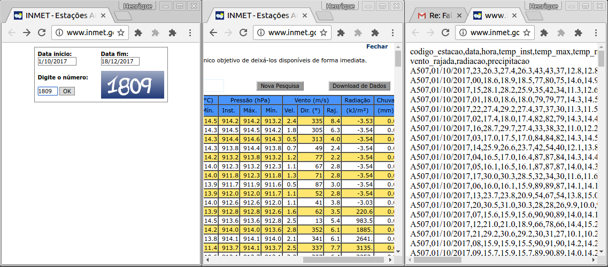

# Predicting internet broadband errors

Dados sobre condições metereológicas foram utilizados com o intuito de aplicar uma correlação entre estes dados com possíveis problemas na banda larga. Essa correlação parece algo natural tanto na cabeça de alguns clientes como de alguns funcionários da empresa, mas não temos nenhum estudo que esboce confirme ou que desbanque essa hipótese.

Portanto, este estudo tem por objetivo traçar uma correlação entre dados metereológicos como chuva, vento, radiação, pressão, temperatura e umidade com os dados na porta do cliente como taxa de atenuação, taxa de sinal ruído e as taxas de up e downstream.

Espera-se que um cliente possua suas taxas de sinal ruído, atenuação, up e downstream constantes e dentro do limite recomendado. Dessa forma, o objetivo deste trabalho é descobrir para cada variável do cliente, qual a correlação para cada uma das variáveis metereológicas. Portanto, queremos definir se a correlação é forte, fraca ou inexistente para cada par de variáveis do conjunto A com o conjunto B.

- Coleta de dados metereológicos:
	Os dados de informações metereológicas foram extraídos do site inmet (http://www.inmet.gov.br), com a ajuda do José Carlos Figueiredo (figueiredo@ipmet.unesp.br) que me enviou uma URL de consulta de dados específicos para a cidade de Uberlândia (http://www.inmet.gov.br/sonabra/pg_dspDadosCodigo_sim.php?QTUwNw==).

	Os dados presentes nesse relatório são sobre: umidade, temperatura, precipitação, vento, ponto de orvalho e radiação. No período de 01/10/2017 até 18/10/2017.

	Os dados foram coletados como segue na Figura 1.
	
